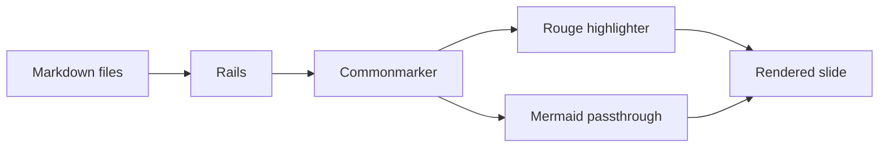

## Architecture at a glance

```mermaid
graph LR
  MD[Markdown files] --> R[Rails]
  R --> CM[Commonmarker]
  CM --> RG[Rouge highlighter]
  CM --> MM[Mermaid passthrough]
  RG --> HTML
  MM --> HTML[Rendered slide]
```

Mermaid blocks pass through the renderer and become diagrams in the browser.
